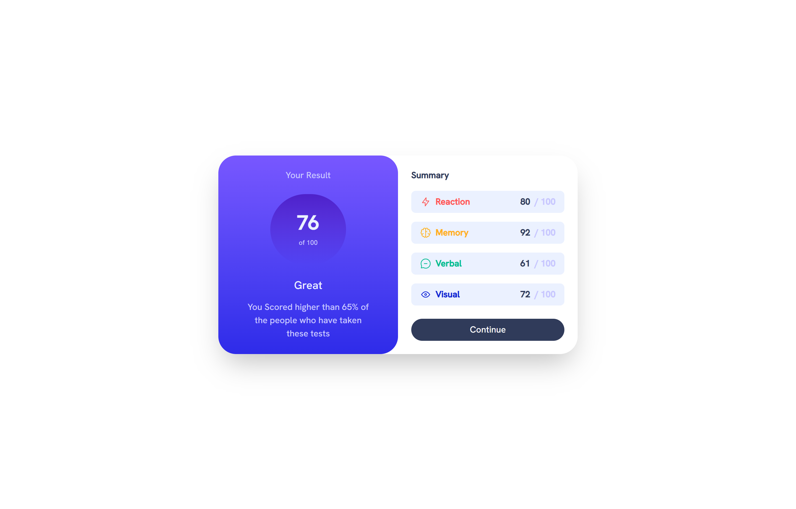

# Frontend Mentor - Results summary component solution

This is a solution to the [Results summary component challenge on Frontend Mentor](https://www.frontendmentor.io/challenges/results-summary-component-CE_K6s0maV). Frontend Mentor challenges help you improve your coding skills by building realistic projects.

## Table of contents

- [Overview](#overview)
  - [The challenge](#the-challenge)
  - [Screenshot](#screenshot)
  - [Links](#links)
- [My process](#my-process)
  - [Built with](#built-with)
  - [What I learned](#what-i-learned)
  - [Useful resources](#useful-resources)
- [Author](#author)

## Overview

### The challenge

Users should be able to:

- View the optimal layout for the interface depending on their device's screen size
- See hover and focus states for all interactive elements on the page
- **Bonus**: Use the local JSON data to dynamically populate the content

### Screenshot



### Links

- Solution URL: [Add solution URL here](https://your-solution-url.com)
- Live Site URL: [Add live site URL here](https://your-live-site-url.com)

## My process

### Built with

- Mobile-first workflow
- [Tailwind CSS](https://tailwindcss.com) - CSS Framework
- [React](https://reactjs.org/) - JS library

### What I learned

I learned how to use custom font with tailwind @theme

```css
@font-face {
  font-family: 'Hanken Grotesk';
  src: url(/assets/fonts/HankenGrotesk-VariableFont_wght.ttf) format('truetype');
  font-weight: 500;
  font-style: normal;
}

@theme {
  --font-hanken: 'Hanken Grotesk';
}
```

### Continued development

### Useful resources

- [coolors](https://coolors.co/) - This helped me for visualize color and browse trend colors

## Author

- Website - [Muhammad Alfi Zain](https://muhammad-alfi-zain.vercel.app/)
- Frontend Mentor - [@AlfiZain](https://www.frontendmentor.io/profile/AlfiZain)
